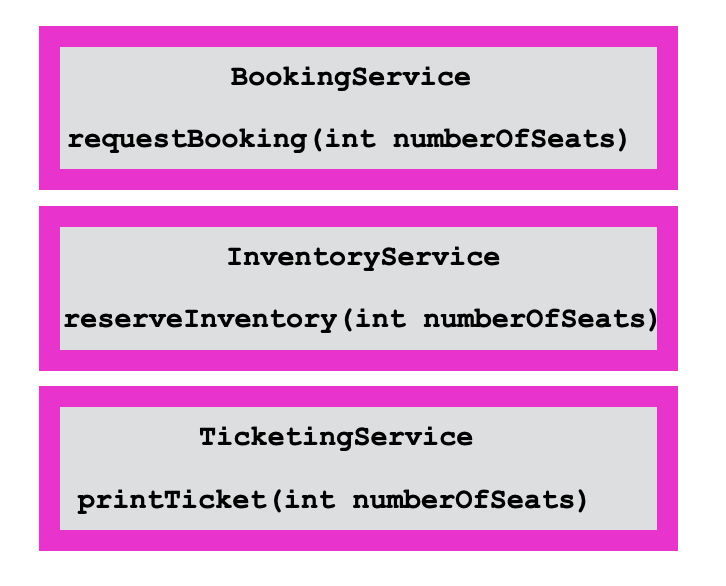

# Choreography Kata

A kata to learn and practice Choreography as opposed to Orchestration, as in a microservices architecture

Below the english and french versions.



# Problem Statement (english)

Let's consider a system to sell theater tickets online. It's made of:

- a Booking service with a book(int numberOfSeats) function (that prints "booking requested" in the standard out while pretending it's done its work)
- an Inventory service with a decrementCapacity(int numberOfSeats) function (that checks if there's enough capacity left, then decrements the internal capacity counter then prints the remaining capacity in the standard out)
- a Ticketing service with a printTicket(int numberOfSeats) function (that prints "ticket printed" in the standard out while pretending it's done its work)

## Steps

**Traditional Approach**

1. Create each service naively, each as just one class. Have them call each other until the whole process works. Then propose a way to refactor so that the Booking service doesn't do too much.
1. Extract the orchestration part out of the Booking service, into a new service. Try to recogize the standard corresponding design pattern.
1. Right now the buyer is not informed when there's no seat left, you need to add a notification service (text or email) for this cas. Add the new service and integrate it so that it gets notified when needed.
1. Observe and comment the necessary changes when adding or suppressing new services. Propose an alternative approach.

**Alternative Approach**

1. Introduce your own EventBus as a simple alternative pattern (code sample below in Java) (BONUS: You may as well introduce the bus by progressively refactor your orchestrator). Then transform the services so that all the coordination is done through the bus, without the Notification service to start with.
1. Now add the Notification service, then observe and comment the necessary changes when adding or suppressing new services. 
1. Compare both approaches, observe how the workflow logic is now fragmented into each service. Debrief: compare respective advantages and drawbacks of each apprach, and which constraints are necessary to follow the Open-Close principle.


```java
/** The listener interface */
public interface Listener {
  void onMessage(Object msg);
}

/**
 * A simple in-memory, observer-pattern-based single-threaded message bus for designing architecture and testing using unit tests before switching to using actual middleware
 */
public class MessageBus {
    private List<Listener> subs = new ArrayList<Listener>();

    public void subscribe(Listener l) {
        this.subs.add(l);
    }

    public void send(Object msg) { 
        for (Listener l : subs) {
            l.onMessage(msg);
        }
    }
}
```

You may want to restrict the messages on the bus to be only events:

```java
/**
 * A basic event with a name and one single integer value
 */
public class Event {
  private final String name;
  private final int value;

  public Event(String name, int value) {
    this.name = name;
    this.value = value;
  }

  public String getName() {return name;}
  public int getValue() {return value;}
}
```


This kata covers the following aspects: **Event-Driven Architecture**, **Choreography over Orchestration** and **Smart Endpoints, Dump Pipes**, which together form the microservices architectural style.


## Enoncé du problème (Francais)


Considérons un système de distributions de billets de spectacles en ligne. Le processus de vente consiste typiquement à Réserver (Booking), puis à réduire l'inventaire en correspondance s'il reste suffisamment de place (Inventory), puis à envoyer les billets (Ticketing), chacune de ces étapes étant un service distinct :
- un service Booking avec une fonction book(int numberOfSeats) qui imprime "booking requested" dans la sortie standard quand l'action est considérée comme faite.
- un service Inventory avec une fonction decrementCapacity(int numberOfSeats) qui vérifie qu'il y a assez de places, et dans ce cas décrémente le compteur interne de places disponibles et affiche le nombre de places restantes.
- un service Ticketing avec une fonction printTicket(int numberOfSeats) qui affiche "ticket printed" quand l'action est considérée comme faite.

## Les étapes :

**Approche traditionnelle**

1. Créer chaque service au plus simple (au plus naïf) et les faire s'appeler entre eux pour implémenter le workflow complet. Proposer un refactoring pour simplifier Booking.
1. Extraire la partie orchestration hors du service Booking, dans un nouveau service. Reconnaitre le design pattern classique auquel il correspond.
1. L'acheteur n'est pas informé s'il n'y a plus de place, il faut ajouter une notification (SMS ou email) dans ce cas. Ajouter le nouveau service Notification et faire en sorte qu'il soit appelé quand nécessaire.
1. Observer et commenter les changements nécessaires lors de l'ajout (ou la suppression) de nouveaux services. Proposer une approche alternative.

**Approche alternative**

1. Introduire votre propre EventBus sous forme d'un simple pattern Observer (exemple de code dans la version anglaise), et transformer les services pour que toute la coordination se passe au travers du bus, sans le service Notification dans un premier temps.
1. Ajouter le service Notification, puis observer et commenter les changements nécessaires lors de l'ajout (ou la suppression) de nouveaux services. 
1. Comparer les deux approches, observer comment la logique du workflow est fragmentée dans chaque service. En débrief, donner les avantages et inconvénients respectifs de chaque approche, et quelles contraintes sont nécessaires pour respecter le principe Open-Close.

Si vous le souhaitez, vous pouvez aussi n'envoyer que des messages de type événements métier.

Ce kata couvre les aspects **Event-Driven Architecture**, **Choreography over Orchestration** et **Smart Endpoints, Dump Pipes**, qui ensemble font le style d'architecture microservices.
